# 🚆 Online Reservation System

A desktop-based **Online Reservation System** developed using **Java Swing, JDBC, and MySQL** as part of the **OIBSIP Java Development Internship – Task 1**.

The application allows users to create an account, log in, search for trains, make reservations, generate PNR numbers, retrieve booking details, cancel reservations, and log out through a user-friendly Java Swing interface.

---

## ✨ Features

- 🔐 User login and authentication
- 🆕 Create a new user account
- ⚠️ Access denied handling for invalid login
- 🚆 Train search and selection
- 🎫 Railway reservation
- 👤 Passenger information entry
- 🧾 Automatic PNR generation
- 🔎 Retrieve reservation details using PNR
- ❌ Cancel existing reservations
- ✅ Booking and cancellation confirmation
- 🚪 Logout functionality
- 🗄️ MySQL database integration
- 🔗 JDBC connectivity
- 🔒 Database credentials protected using `.gitignore`

---

## 🛠️ Technologies Used

- **Java**
- **Java Swing**
- **JDBC**
- **MySQL**
- **Maven**
- **IntelliJ IDEA**

---

## 🏗️ Project Architecture

The project follows a simple layered architecture:

```text
Online Reservation System
│
├── UI Layer
│   └── Java Swing
│
├── DAO Layer
│   └── Database Operations
│
├── Service Layer
│   └── PNR Generation
│
├── Model Layer
│   └── Reservation
│
└── Database Layer
    └── JDBC → MySQL
UI Layer
LoginFrame
MainFrame
ReservationPanel
CancellationPanel
DAO Layer
UserDAO
TrainDAO
ReservationDAO
Model Layer
Reservation
Service Layer
PNRGenerator
Database Layer
DBConnection
📂 Project Structure
JavaDev-Task1-OnlineReservationSystem
│
├── database
│   └── schema.sql
│
├── screenshots
│   ├── access-denied.png
│   ├── booking-confirmation-pnr.png
│   ├── cancellation-confirmation.png
│   ├── cancellation-success.png
│   ├── create-account.png
│   ├── fetched-booking-details.png
│   ├── login-screen.png
│   ├── logout.png
│   ├── mysql-database-tables.png
│   ├── mysql-reservations-table.png
│   ├── mysql-trains-table.png
│   ├── mysql-users-table.png
│   └── reservation-booking-form.png
│
├── src
│   └── main
│       ├── java
│       │   └── com
│       │       └── shital
│       │           └── reservation
│       │               ├── Main.java
│       │               │
│       │               ├── dao
│       │               │   ├── ReservationDAO.java
│       │               │   ├── TrainDAO.java
│       │               │   └── UserDAO.java
│       │               │
│       │               ├── db
│       │               │   └── DBConnection.java
│       │               │
│       │               ├── model
│       │               │   └── Reservation.java
│       │               │
│       │               ├── service
│       │               │   └── PNRGenerator.java
│       │               │
│       │               └── ui
│       │                   ├── CancellationPanel.java
│       │                   ├── LoginFrame.java
│       │                   ├── MainFrame.java
│       │                   └── ReservationPanel.java
│       │
│       └── resources
│           └── config.example.properties
│
├── pom.xml
├── README.md
└── .gitignore
🔄 Application Workflow
Create Account
      ↓
    Login
      ↓
  Main Menu
      ↓
Reservation Form
      ↓
Enter Passenger Details
      ↓
Select Train
      ↓
Generate PNR
      ↓
Booking Confirmation
      ↓
Fetch Booking Details
      ↓
Cancel Reservation
      ↓
Cancellation Confirmation
      ↓
    Logout
🗄️ Database

The application uses MySQL to store users, trains, and reservation information.

Database Name
reservation_system
Tables
users
trains
reservations
Database Relationship
trains
   │
   │ train_number
   ▼
reservations

The train_number in the reservations table references the train_number in the trains table using a foreign key.

📋 Database Schema
Users Table

Stores user login information.

Column	Description
id	Unique user ID
username	User login name
password	User password
Trains Table

Stores available train information.

Column	Description
train_number	Unique train number
train_name	Name of the train
Reservations Table

Stores passenger reservation information.

Column	Description
pnr	Unique reservation PNR
passenger_name	Passenger name
train_number	Selected train
class_type	Travel class
journey_date	Date of journey
source_station	Starting station
destination_station	Destination station
created_at	Reservation creation timestamp
🔌 JDBC Configuration

The application connects Java to MySQL using JDBC.

The actual database configuration file is:

src/main/resources/config.properties

This file is intentionally excluded from Git because it contains the local MySQL password.

A safe example configuration is provided:

src/main/resources/config.example.properties

Example:

db.url=jdbc:mysql://localhost:3306/reservation_system
db.username=root
db.password=YOUR_MYSQL_PASSWORD

Replace YOUR_MYSQL_PASSWORD with your own local MySQL password.

▶️ How to Run
1. Clone the Repository
git clone https://github.com/shital2904/OIBSIP.git
2. Open the Project

Open the following folder in IntelliJ IDEA:

JavaDev-Task1-OnlineReservationSystem

Make sure IntelliJ recognizes it as a Maven project.

3. Configure MySQL

Start your MySQL server.

Open:

database/schema.sql

Run the SQL script in MySQL Workbench.

This creates the required:

Database
Users table
Trains table
Reservations table
Sample train data
4. Configure Database Credentials

Create:

src/main/resources/config.properties

Add:

db.url=jdbc:mysql://localhost:3306/reservation_system
db.username=root
db.password=YOUR_MYSQL_PASSWORD

Use your own MySQL password.

5. Run the Application

Open:

src/main/java/com/shital/reservation/Main.java

Run Main.java.

The Java Swing login screen will appear.

🔑 Demo Login

For the internship demonstration, the database contains:

Username: admin
Password: admin123

This is intended only for educational/demo purposes.

🧪 Important SQL Commands
Create Database
CREATE DATABASE IF NOT EXISTS reservation_system;
Select Database
USE reservation_system;
Show Tables
SHOW TABLES;
View Users
SELECT id, username
FROM users;
View Trains
SELECT *
FROM trains;
View Reservations
SELECT *
FROM reservations;
Search Reservation Using PNR
SELECT *
FROM reservations
WHERE pnr = 'YOUR_PNR';
Count Available Trains
SELECT COUNT(*) AS total_trains
FROM trains;
## 📸 Application Screenshots

### 1. 🔐 Login Screen

The login screen allows registered users to authenticate before accessing the reservation system.

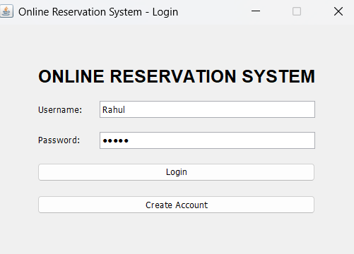

---

### 2. 🆕 Create Account

New users can create an account before logging into the reservation system.

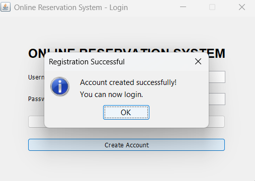

---

### 3. ⚠️ Access Denied

The application displays an access-denied message when invalid login credentials are entered.

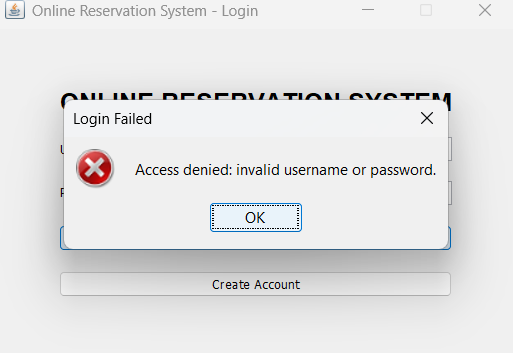

---

### 4. 🎫 Reservation Booking Form

Users can enter passenger details, select the train, choose the class, and provide journey information.

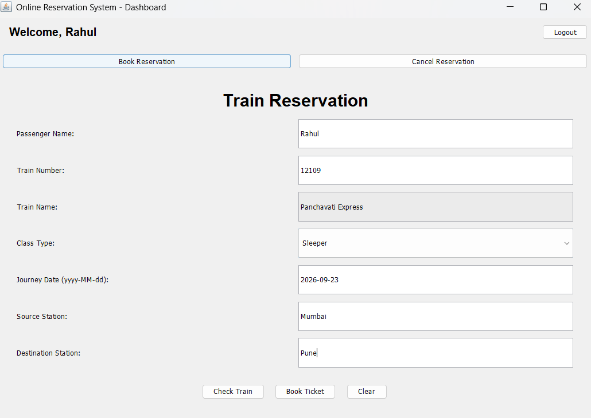

---

### 5. 🧾 Booking Confirmation & PNR

After successful reservation, the system generates a unique PNR and displays the booking confirmation.

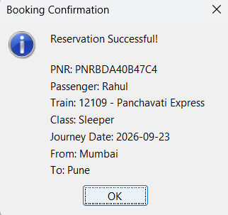

---

### 6. 🔎 Fetched Booking Details

Users can retrieve their reservation information using the generated PNR.

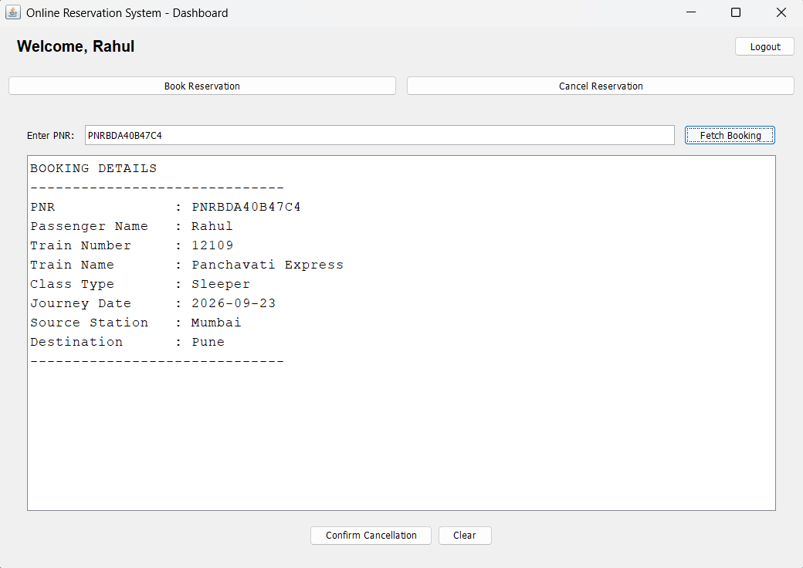

---

### 7. ❌ Cancellation Confirmation

The system asks for confirmation before cancelling an existing reservation.

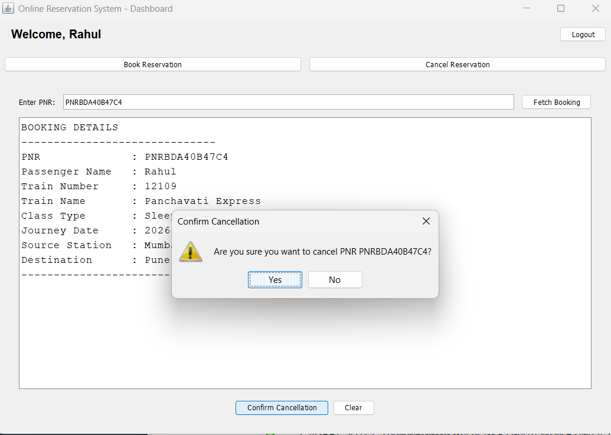

---

### 8. ✅ Cancellation Success

After successful cancellation, the application displays a confirmation message.

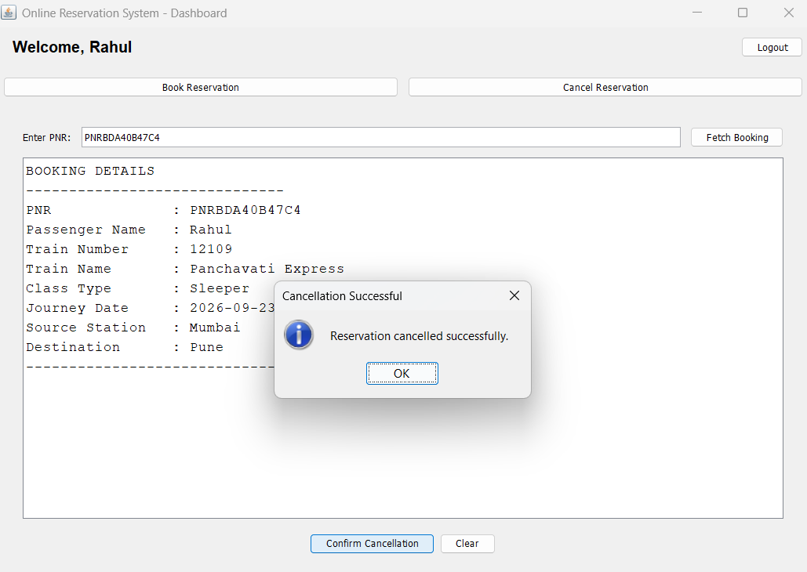

---

### 9. 🚪 Logout

Users can safely log out of the reservation system.

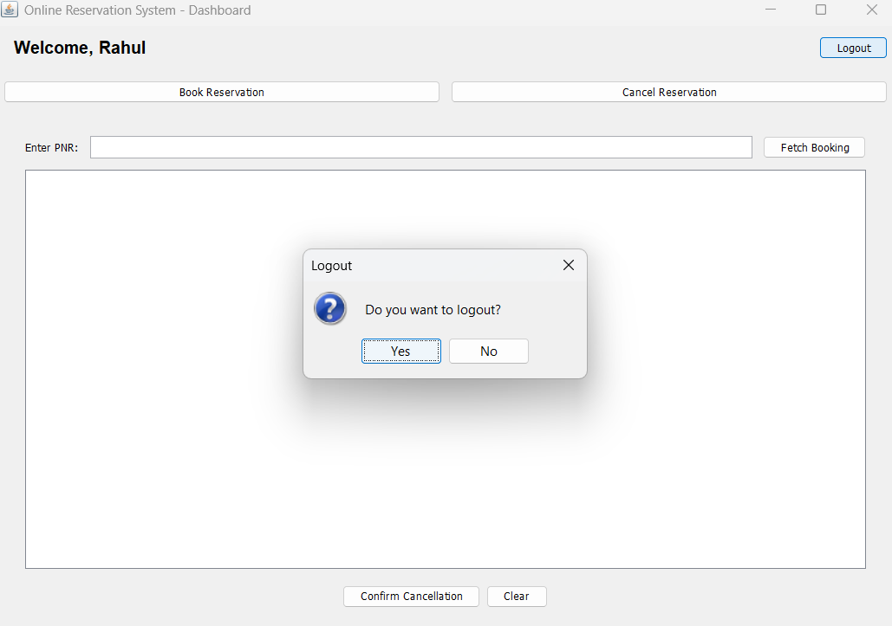

---

## 🗄️ MySQL Database Screenshots

### 10. 📊 Database Tables

Displays the tables created inside the `reservation_system` database.

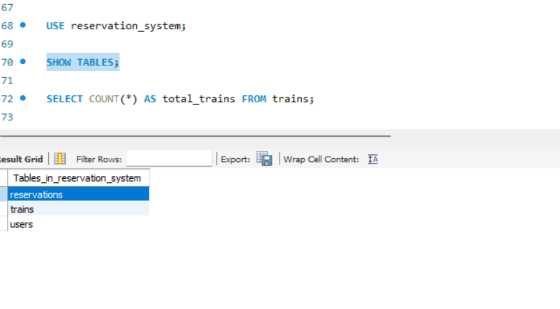

---

### 11. 👤 Users Table

Displays registered users stored in the MySQL database.

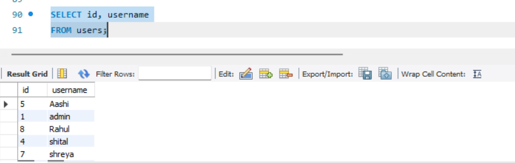

---

### 12. 🚆 Trains Table

Displays the available trains and their train numbers.

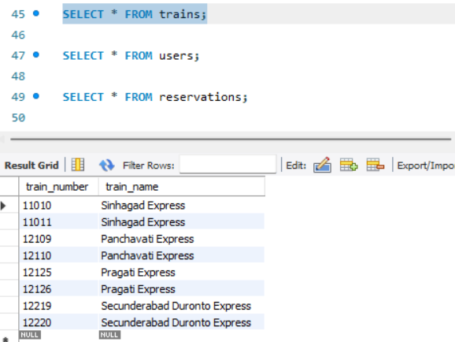

---

### 13. 🎫 Reservations Table

Displays reservation records stored by the Java application.

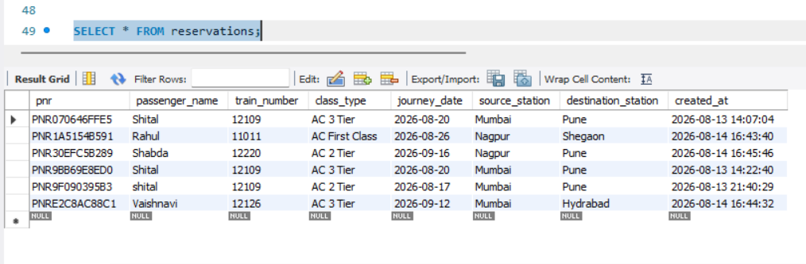

🔒 Security

Sensitive database credentials are not committed to the GitHub repository.

The following file is excluded using .gitignore:

src/main/resources/config.properties

Only the safe example configuration is included:

src/main/resources/config.example.properties
Important

This project is intended for educational and internship purposes.

In a production application:

User passwords should be securely hashed.
Database credentials should be stored using environment variables or a secure secrets manager.
Authentication and authorization should use stronger security practices.
📚 Concepts Demonstrated

This project demonstrates practical implementation of:

Object-Oriented Programming
Java Swing GUI development
Event handling
JDBC
MySQL
SQL
CRUD operations
DAO pattern
Layered architecture
Foreign key relationships
Exception handling
Input validation
Database connectivity
PNR generation
Maven dependency management
🎓 Internship

OIBSIP – Java Development Internship

Task 1 – Online Reservation System