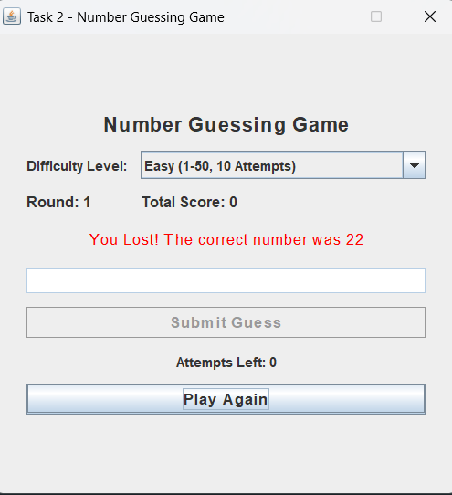

# Number Guessing Game - Java

A console-based Number Guessing Game developed using Java as part of the Oasis Infobyte Java Development Internship. The application generates a random number, and the player attempts to guess it with the help of hints.

## ✨ Features

- 🎲 Generates a random number
- 🎯 Allows the user to enter guesses
- 💡 Provides hints if the guessed number is higher or lower
- 🔢 Counts the number of attempts
- 🏆 Displays the result when the correct number is guessed
- 🔄 Allows the user to play the game again
- ⚠️ Handles invalid user input
- 🚪 Option to exit the game

## 🛠️ Technologies Used

- Java
- Scanner
- Random
- Java Control Statements

## 📁 Project Structure

```text
src
└── NumberGuessingGame.java

screenshots
└── Screenshot_2026.png

README.md
.gitignore
```

## ▶️ How to Run

### IntelliJ IDEA

1. Open the project in IntelliJ IDEA.
2. Configure a Java JDK.
3. Open `src/NumberGuessingGame.java`.
4. Run the `NumberGuessingGame` class.
5. Enter your guess in the console.

### Command Line

Compile:

```bash
javac -d out src/NumberGuessingGame.java
```

Run:

```bash
java -cp out NumberGuessingGame
```

## 🎮 How the Game Works

1. The program generates a random number.
2. The player enters a guess.
3. The program checks the guessed number.
4. If the guess is too high, a lower-number hint is displayed.
5. If the guess is too low, a higher-number hint is displayed.
6. The game continues until the correct number is guessed.
7. The total number of attempts is displayed.

## 📸 Output

The following screenshot shows the output of the Number Guessing Game:



## 🎓 Internship

**OIBSIP - Java Development Internship**

**Task 2 - Number Guessing Game**
