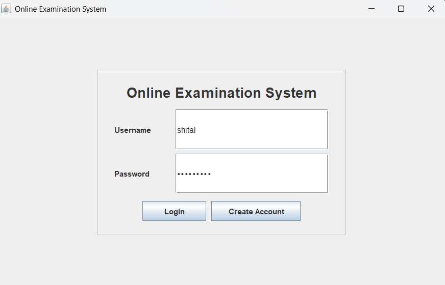
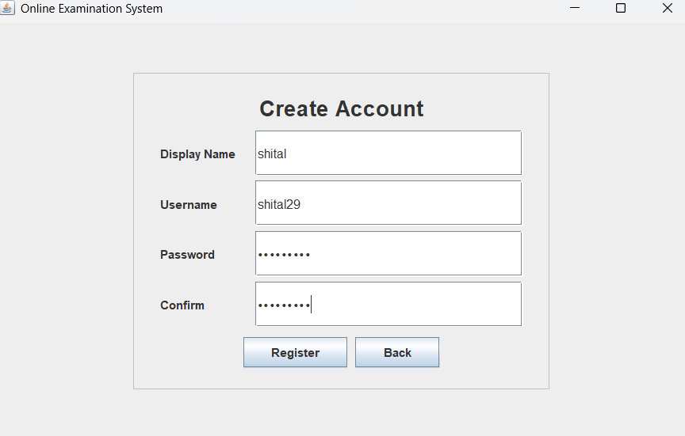
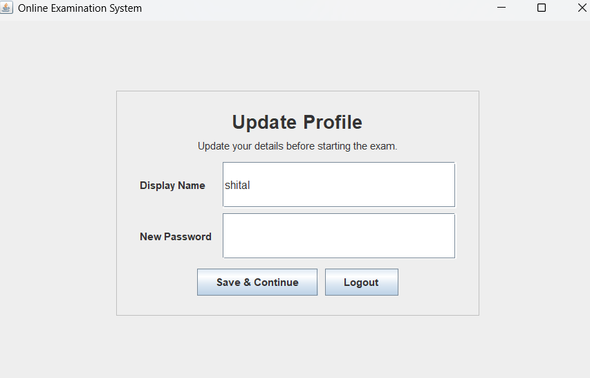
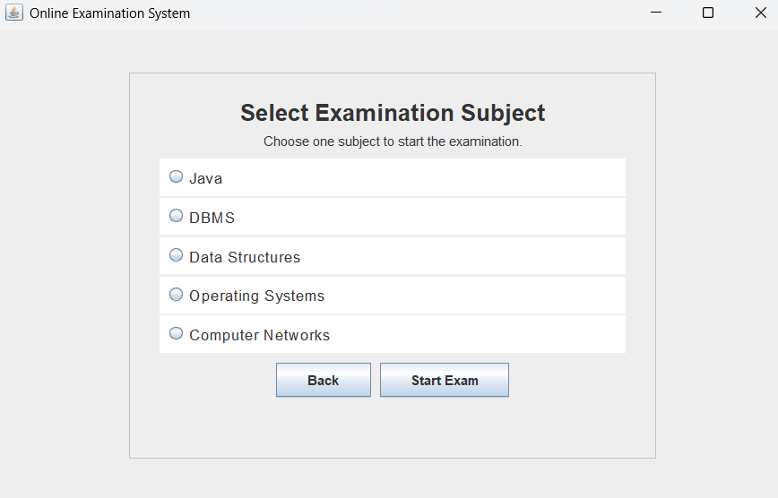
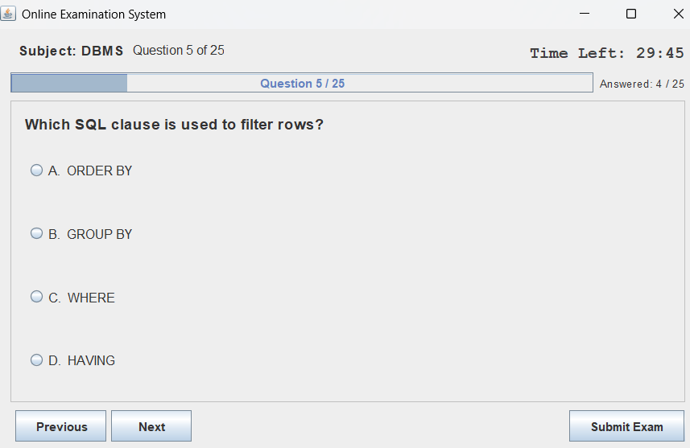
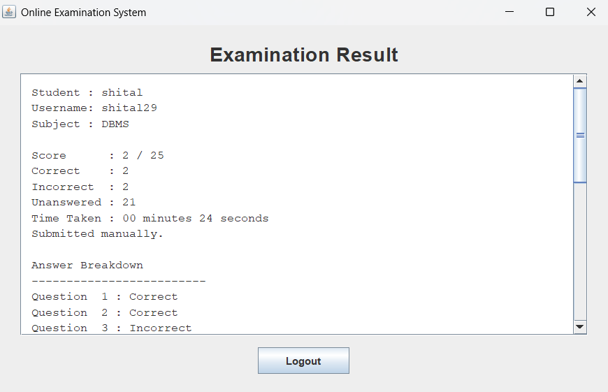

Task 1 – Online Reservation System  this is my readme content but want it like online examination# 📝 Online Examination System - Java Swing 
 
A desktop-based Online Examination System built using **Java Swing**. The application provides a simple platform for students to create an account, log in, update their profile, select an examination subject, answer multiple-choice questions, and view their final examination results. 
 
## 🚀 Key Features 
 
- 🔐 Secure user login 
- 🆕 Create a new student account 
- 👤 Update profile information 
- 📚 Subject selection 
- 💻 Java examination 
- 🗄️ DBMS examination 
- 🌳 Data Structures examination 
- ⚙️ Operating Systems examination 
- 🌐 Computer Networks examination 
- ❓ Multiple-choice questions with four options 
- 🔢 25 questions for each subject 
- ⏱️ 30-minute examination timer 
- 📊 Progress bar and answered-question counter 
- ◀️ Previous and ▶️ Next question navigation 
- 📤 Manual examination submission 
- 🤖 Automatic submission when the timer expires 
- 🏆 Final result with score details 
- ⌛ Displays time taken to complete the examination 
- ⚠️ Confirmation before quitting or submitting 
- 🚪 Logout functionality 
 
## 🛠️ Technologies & Tools 
 
| Technology | Purpose | 
|------------|---------| 
| Java | Core application development | 
| Java Swing | Graphical User Interface | 
| AWT | GUI components and event handling | 
| Collections Framework | Managing questions and user data | 
| `javax.swing.Timer` | Examination countdown timer | 
| IntelliJ IDEA | Development environment | 
 
## 📂 Project Structure
text JavaDev-Task4-OnlineExaminationSystem │ ├── src │ ├── Main.java │ ├── ExamApplication.java │ ├── Question.java │ ├── QuestionBank.java │ ├── User.java │ └── UserStore.java │ ├── screenshots │ ├── login.png │ ├── createaccount.png │ ├── Updateprofile.png │ ├── selectsubj.png │ ├── examination.png │ └── result.png │ ├── README.md └── .gitignore
## ▶️ How to Run 
 
### Using IntelliJ IDEA 
 
1. Open the project in IntelliJ IDEA. 
2. Configure a compatible Java JDK. 
3. Open `src/Main.java`. 
4. Run the `Main` class. 
5. The application login window will appear. 
 
### Using Command Line 
 
Compile the Java files:
bash javac -d out src/*.java
Run the application:
bash java -cp out Main
## 🔑 Login & Account Creation 
 
Users can either: 
 
- Log in using an existing account. 
- Create a new account using the **Create Account** option. 
 
Example demo credentials:
text Username: student Password: 1234
## 📚 Examination Process 
 
The examination follows these steps:
text Login ↓ Create/Update Profile ↓ Select Subject ↓ Start Examination ↓ Answer Questions ↓ Submit Examination ↓ View Result
Students can move between questions using the **Next** and **Previous** buttons. 
 
## ⏱️ Examination Timer 
 
Each examination has a **30-minute countdown timer**. 
 
When the timer reaches zero, the examination is automatically submitted and the result is displayed. 
 
## 🏆 Result 
 
After submission, the result screen displays information such as: 
 
- Total score 
- Correct answers 
- Incorrect answers 
- Unanswered questions 
- Time taken 
 
## 💾 Data Storage 
 
This application does not require an external database. 
 
User details and examination questions are maintained **in memory during the application session**. 
 
## 📸 Application Screenshots 
 
### 🔐 Login 
 
 
 
### 🆕 Create Account 
 
 
 
### 👤 Update Profile 
 
 
 
### 📚 Select Subject 
 
 
 
### 📝 Examination 
 
 
 
### 🏆 Result 
 
 
 
 
## 🎓 Internship 
 
**OIBSIP - Java Development Internship** 
 
**Task 4 - Online Examination System** like it which also screenshot order wise like createacc then login last logout sequence wise
